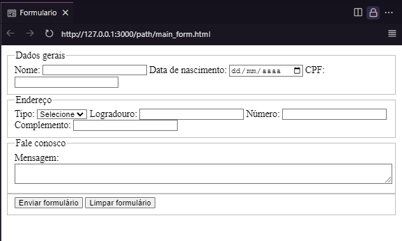

# Criando formulário

Adicionando alguns projetos e aprendizagens que estou desenvolvendo na faculdade de Análise e Desenvolvimento de Sistemas da Estácio. Aqui mostro um pouco sobre criação de formulários!

## Conteúdo

- [Descrição](#descrição)
- [Tags](#tags)
- [Formulário completo](#formulário-completo)

## Descrição

>Usando o construtor de formulário [form](#form) para semântica, nele conseguimos criar então um [fieldset](#fieldset) - não é obrigatório mas fica com uma visualização melhor para o usuário - com uma legenda/titulo sobre o que se trata o formulário. Assim com a tag [label](#label) conseguimos nossa primeira "etiqueta" para nosso elemento de inserção de dados [input](#label). Com essas tags conseguimos criar um formulário simples. Vamos adicionar mais tags ao nosso formulário para extrair mais dados do usuário. Veja abaixo as tags que utilizamos e a representação dos formulários, caso necessário visite os [templates](https://github.com/Felipe-Tamura/Formularios/tree/main/templates) para melhor visualização ou o [arquivo_completo](https://github.com/Felipe-Tamura/Formularios/tree/main/path).

## Tags

### ```<form>``` 
> Construtor do formulário.
>
> Parâmetros:
> - action: Indica o local para onde os dados irão ser tratados;
> - method: Indica qual o metodo HTTP que o formulário irá retornar.

### ```<fieldset>```
>Agrupa elementos para o formulário.

### ```<legend>``` 
>Nome para o grupo de elementos.

### ```<label>```
>Etiqueta para o elemento de [input](#input).
>
>Parâmetros:
> - for: Para fazer ligação com o [input](#input)

### ```<input>```
>Campo para inserir dados (texto, número, data, etc.).
>
>Parâmetros:
> - type: Indica o tipo de dado que será inserido neste elemento;
> - minlength: Qual o tamanho mínimo de caracteres

### ```<select>```
>Caixa de seleção de itens.

### ```<option> ```
>Opções para a caixa de seleção.
>
>Parâmetros:
>    - value: Rótulo sobre a opção de seleção.

### ```<textarea>```
>Campo de texto, neste campo aumenta o limite de caracteres que o usuário consegue inserir.
>
>Parâmetros:
> - name: Nome para o controle.

### ```<button>```
>Botões de ação para enviar ou limpar o formulário.
>
>Parâmetro:
> - type: Tipo de ação para o botão.
---
***OBS: Estou explicando cada funcionalidade das tags que estou utilizando com a descrição sobre como foi usado neste repositório, para mais detalhes sobre estas tags veja o site [mdn web doc](https://developer.mozilla.org/pt-BR/docs/Web/HTML).***

## Formulário completo

<p align="center">
    
</p>

[Ir par ao topo](#criando-formulário)